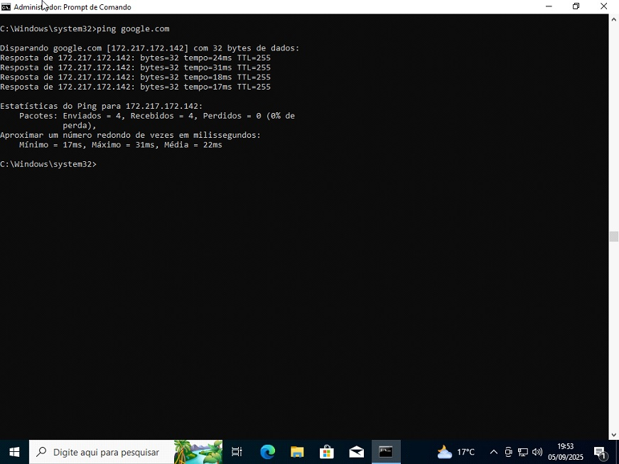
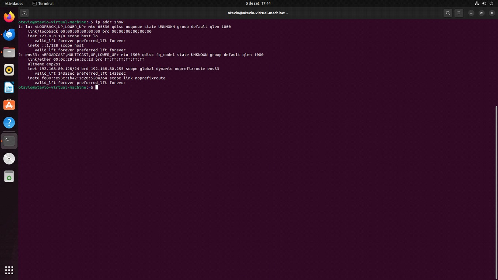

# Relatório — Sistemas Operacionais (Grupo 10)

## 📌 Projeto
Este projeto tem como objetivo configurar e comparar máquinas virtuais (VMs) utilizando *Windows, **Linux* e *Android, explorando o uso das ferramentas **VirtualBox* e *VMware* para entender desempenho, usabilidade e características de cada sistema.  

O trabalho foi desenvolvido na disciplina *Sistemas Operacionais, sob orientação do professor **Clóvis Ferraro*.  

---

## 📖 Conteúdo
1. Introdução  
2. Metodologia  
3. Comparação entre os Sistemas Operacionais  
   - Windows  
   - Linux  
   - Android  
   - Comparação Crítica  
4. Análise Crítica  
5. Conclusão  
6. Autoavaliação  
7. Referências  

---

## 🔹 Windows
Ferramentas e comandos utilizados:  
- ipconfig → verificação de IP e conexões de rede.  
- ping google.com → teste de conectividade.  
- *Gerenciador de Tarefas* → monitoramento de CPU, memória e processos.  

### 📷 Imagem ilustrativa dos comandos no Windows  
  

---

## 🔹 Linux
Ferramentas e comandos utilizados:  
bash
ip addr show          # Visualização de IPs
ping -c 4 google.com  # Teste de conectividade
htop                  # Monitoramento de CPU, memória e processos em tempo real
  

### 📷 Imagem ilustrativa dos comandos no Linux  
  

---

## 🔹 Android
Ferramentas e comandos utilizados:  
bash
adb shell top               # Monitoramento de processos ativos
adb shell cat /proc/meminfo # Informações do sistema
  

---

## 📊 Comparação Crítica
- *Windows* → intuitivo e amigável, mas demanda mais recursos da máquina.  
- *Linux* → leve, eficiente e flexível, mas exige maior conhecimento técnico.  
- *Android* → adequado para mobilidade, mas apresenta limitações em VMs.  

---

## ✅ Conclusão
- *Windows: ideal para quem busca **praticidade e compatibilidade*.  
- *Linux: destaca-se pela **eficiência, flexibilidade e controle*.  
- *Android: essencial para **desenvolvimento mobile*, mas restrito em VMs.  

O uso de máquinas virtuais demonstrou-se essencial para estudo, testes e simulações sem comprometer o sistema físico.  

---

## 📝 Autoavaliação
O grupo enfrentou dificuldades na configuração inicial das VMs e instalação de ferramentas adicionais (ex.: *Guest Additions* no VirtualBox).  
Ainda assim, a execução de testes, registros e comparações permitiu aprender a importância dos comandos básicos de administração em diferentes sistemas operacionais.