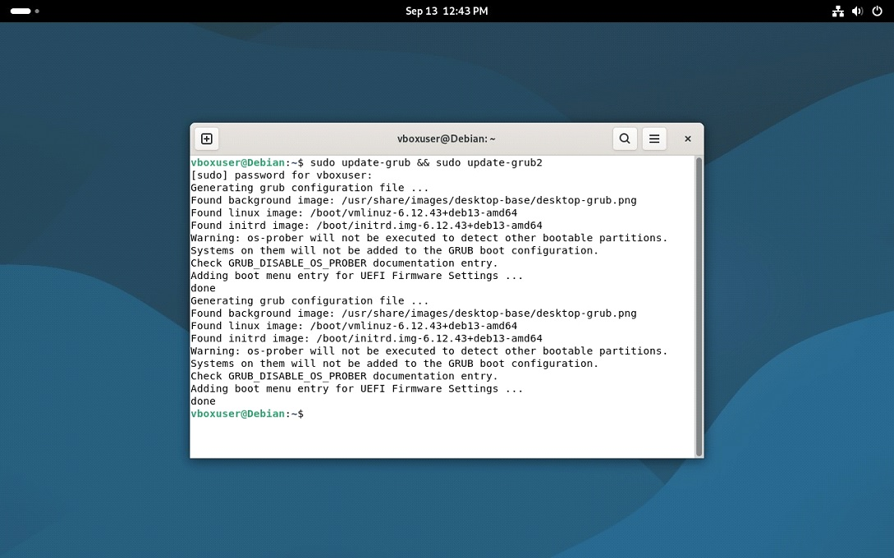
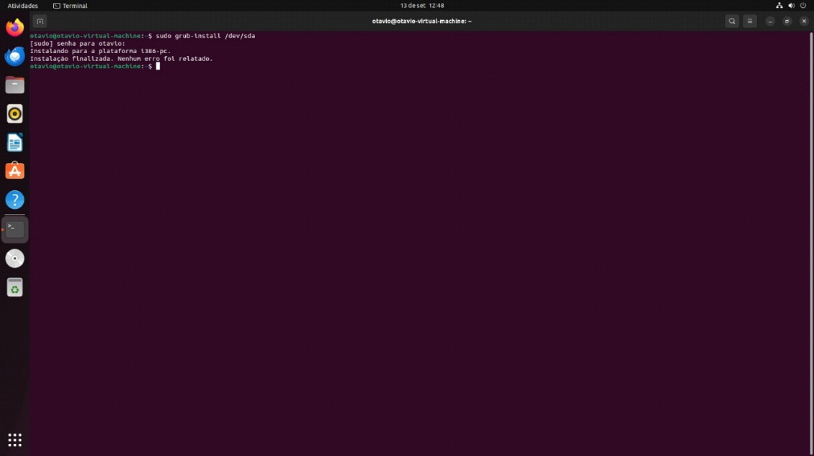

# Relatório do Projeto – VirtualBox e VMware

## 📌 Projeto
Este projeto tem como objetivo configurar e comparar máquinas virtuais (VMs) utilizando *Windows* e *Linux*, explorando os processos de bootstrapping, instalação e inicialização de cada sistema operacional.  

O trabalho foi desenvolvido na disciplina *Sistemas Operacionais, sob orientação do professor **Clóvis Ferraro*.  

---

## 📖 Conteúdo
1. Introdução  
2. Comparação entre os Sistemas Operacionais  
   - Windows  
   - Linux  
   - DualBoot  
   - Comparação Crítica  
3. Análise Crítica  
4. Conclusão  
5. Referências  

---

## 🔹 Windows
O Windows utiliza o *Boot Manager (Bootmgr)* para carregar o Winload, que chama o kernel e inicia os drivers até a tela de login.  
É um processo *automático e fechado*, sem muitas opções de customização pelo usuário.  

*Comandos aplicados (ilustrativos):*
- Acesso via *tecla E* ou *C* durante o boot para edição/diagnóstico.  

### 📷 Imagem ilustrativa dos comandos no Windows
  

---

## 🔹 Linux
O Linux inicia pelo *GRUB*, que chama o kernel e, em seguida, o init ou systemd, responsáveis por carregar os serviços e preparar o ambiente.  
Diferente do Windows, o Linux oferece *transparência e controle total* sobre cada etapa.  

*Sequência de comandos aplicados:*
bash
sudo grub-install
sudo update-grub
lsblk
mount | grep sda2
sudo parted /dev/sda print

### 📷 Imagem ilustrativa dos comandos no Linux
  

---

## 📊 Comparação Crítica
- *Linux* → mais aberto, flexível e personalizável, ideal para ambientes técnicos.  
- *Windows* → mais fechado, simples e padronizado, ideal para usuários comuns.  
- *Resumo: Linux privilegia **controle, enquanto Windows privilegia **praticidade*.  

---

## ✅ Conclusão
O processo de bootstrapping evidencia a filosofia de cada sistema:
- Linux: voltado para usuários que querem *entender e personalizar*.  
- Windows: voltado para usuários que preferem *simplicidade e padronização*.

## 👨‍💻 Grupo
- <a href="https://github.com/juninho-Oliveira">Damião Junior</a>  
- <a href="https://github.com/Luigi-Loc">Luigi Borges Locatelli</a>  
- <a href="https://github.com/OtavioHx0">Otavio Henrique Azevedo Chaves</a> 
- <a href="#">Pedro Henrique Sales Siquele</a>
-   
-    