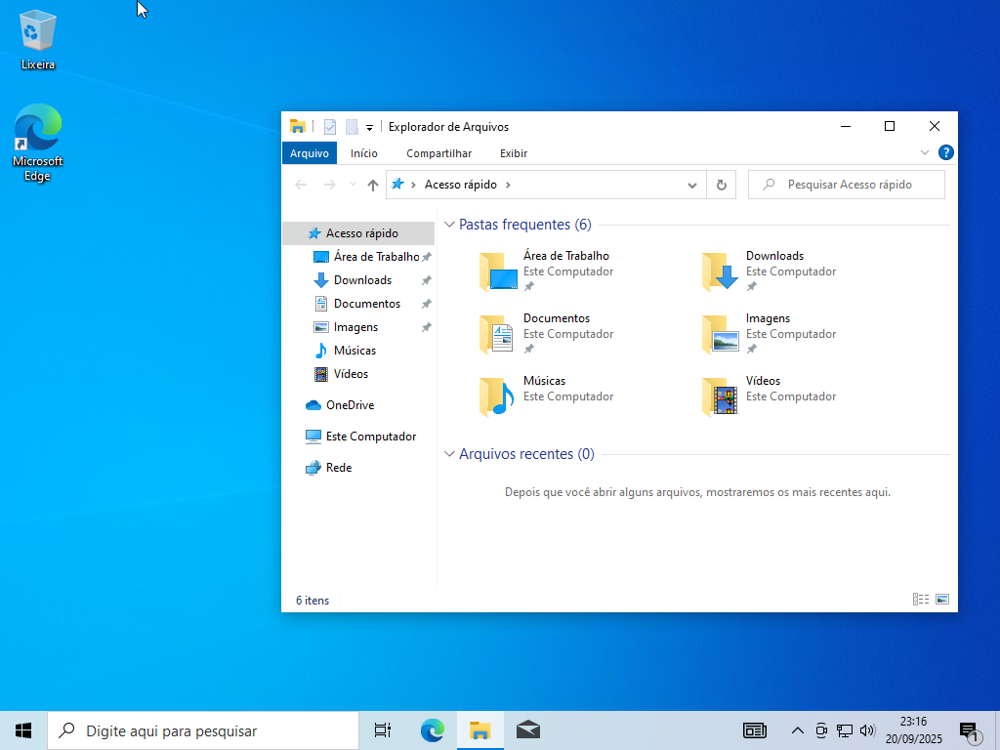
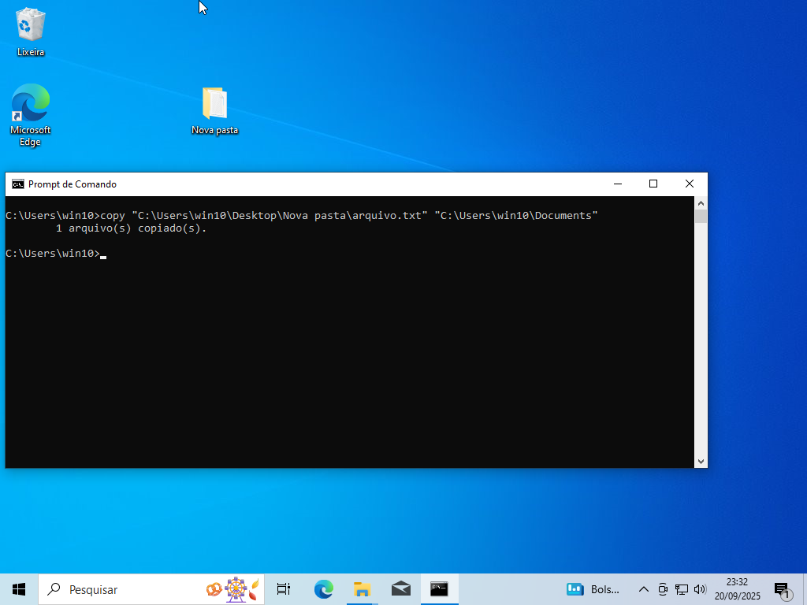

# Relatório do Projeto – Interface GUI e CLI no Windows

## 📌 Projeto
Este projeto tem como objetivo explorar o funcionamento das **interfaces de interação do Windows**:  
- **GUI (Interface Gráfica de Usuário)**  
- **CLI (Interface de Linha de Comando – CMD e PowerShell)**  

O estudo foi realizado na disciplina **Sistemas Operacionais**, sob orientação do professor **Clóvis Ferraro**.  

---

## 📖 Conteúdo
1. Introdução  
2. Windows – GUI  
3. Windows – CLI  
   - Prompt de Comando (cmd.exe)  
   - PowerShell  
4. Exemplos práticos  
5. Conclusão  
6. Referências  

---

## 🔹 Windows – GUI
A interface gráfica do Windows é chamada **Windows Desktop Environment**, composta por:  
- **Menu Iniciar**  
- **Barra de Tarefas**  
- **Área de Trabalho**  
- **Explorador de Arquivos**  

➡ Facilita a interação para usuários comuns, permitindo realizar tarefas como copiar e mover arquivos através de cliques.  

### 📷 Exemplo ilustrativo – GUI
  

---

## 🔹 Windows – CLI
O Windows possui duas interfaces principais de linha de comando:  

- **Prompt de Comando (cmd.exe)**  
  - Acesso: Menu iniciar → `cmd`  
  - Exemplos de comandos:  
    ```bat
    dir
    cd ..
    ipconfig
    copy "C:\Users\win10\Desktop\Nova pasta\arquivo.txt" "C:\Users\win10\Documents"
    ```

- **PowerShell**  
  - Acesso: Menu iniciar → `powershell`  
  - Exemplos de comandos:  
    ```powershell
    Get-ChildItem
    Set-Location ..
    Get-NetIPAddress
    Copy-Item "C:\Users\win10\Desktop\Nova pasta\arquivo.txt" -Destination "C:\Users\win10\Documents"
    ```

### 📷 Exemplo ilustrativo – CLI
  

---

## 📊 Comparação GUI x CLI
- **GUI** → Mais intuitiva, ideal para usuários comuns.  
- **CLI** → Mais rápida e poderosa, ideal
